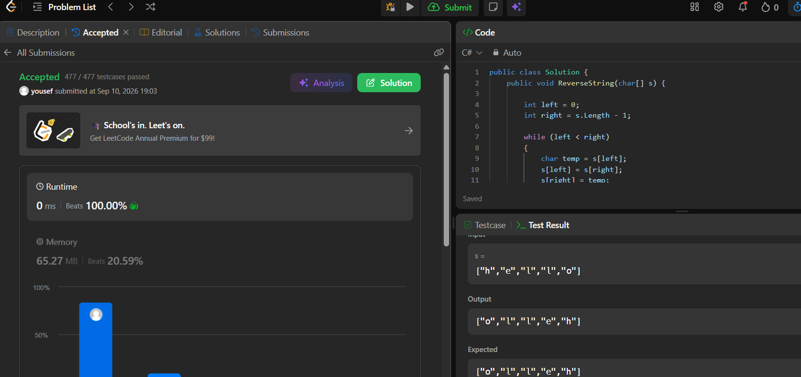

1- 

  2- i made a left iterator and right iterator and swap the value of each and when the left became
  >= the right now we arrived to the middle and while loop stop 

  3- we made only one for loop so time complexity o(n)
  4- we made only 3 extra variables so space complexity o(1)
  